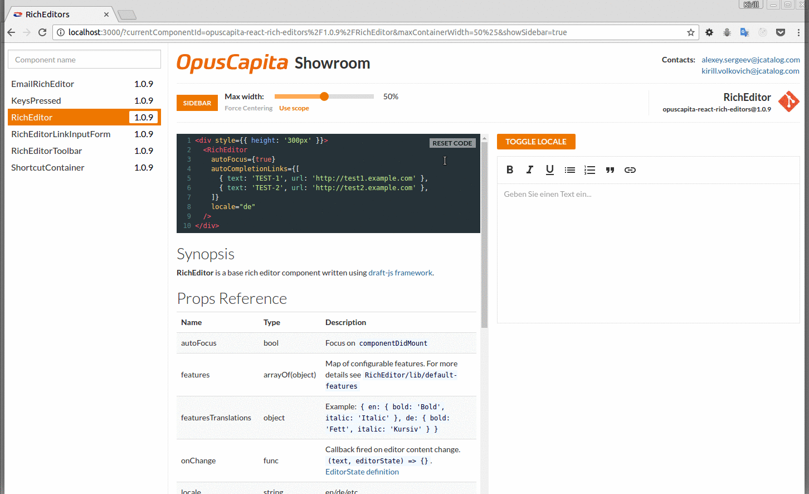

# OpusCapita Showroom

## Synopsis

React based components catalog which provide a **documentation** and **live examples**.

## Motivation to develop

The fundamental ideas of ReactJS is **modularity** and **code reuse**.
You should't rewrite same things every time.

[What ReactJS creators say about it:](https://facebook.github.io/react/docs/thinking-in-react.html)

> How do you know what should be its own component? Just use the same techniques for deciding if you should create a new function or object. One such technique is the [single responsibility principle](https://en.wikipedia.org/wiki/Single_responsibility_principle), that is, a component should ideally only do one thing. If it ends up growing, it should be decomposed into smaller subcomponents.

> As you start to build **large libraries of components**, you'll appreciate this **explicitness** and **modularity**, and with **code reuse**, your lines of code will start to shrink. :)

O.K., **ReactJS creators** :+1: We are sure you are clever men.
We understand your ideas.
But if we want to have a **large libraries of components** we must have a **easy way to organize and browse** this library.

* Facebook have [thousands](https://facebook.github.io/react/docs/composition-vs-inheritance.html#so-what-about-inheritance)  of components.

* In contrast - now we **have no** common **UI** composable pieces which allow developers to construct complex **busines logic** components fast with modern user interface for a better user experience. **Happy customer => happy seller**

* **Twitter Bootstrap/React Bootstrap** don't solve the problem. It have a good looking **typography** and a simple for use **grid system**. It have only a little number of basic components like buttons and inputs.

  For example if you have a vertical split-screen, default **bootstrap grid system** based on **html media-queries** became useless.     Media-queries reacts on **main viewport size** changes, but with split-screen we have two virtual viewports. **Simple react component** tracking size of specified `DOMNode` can solve the problem. If we can't find at http://npmjs.com we can write it themselves and reuse in future.
  
* There are lot of good-written **third-party** components. But they can't cover all use-cases. The problem of most of them:

  Written by different people with a different methodology of development and styles organization (style conflicts are not a rarity)
  
  We can't change them when met a limitations of **API**

**~~Allen Carr~~ The easy way to start organize a libraries:**

* Spent several hours/days for a writing component? Spent a 30-40 minute to put your component in a library and write a simple documentation with code example.
* Next time you or your teammate should't rewrite it again.
* Or you can again spent several hours/days :clock10: to `/dev/null`. 
* **The choice is yours**.

## How to use

### Embedded

* Developer-side variant
* **Always write** the documentation :pencil:
* Take care about other developers and others take care about you :tophat:

[See how to install](./docs/embedded.md)

### Server application

> ! Now it require exposed components from `main` npm package file 

[See how to install](https://github.com/OpusCapitaBES/js-node-showroom-server)

* Browse components catalog
* See usage code examples
* See **API** documentation
* Change component properties and see what happenned **in realtime**
* Change component **version** to see appropriate documentation
* If you run it don't forget configure [this file](https://github.com/OpusCapitaBES/js-react-showroom-client/blob/master/serverConfig.js) accordingly [showroom-server host and port configuration](https://github.com/OpusCapitaBES/js-node-showroom-server/blob/master/README.md#what-this-goal-do)

## See also

* [Component documentation format](./docs/example.DOCUMENTATION.md)
* [Scope component](./docs/scope-component.md)

## Contributors

* Alexey Sergeev - [alexey.sergeev@jcatalog.com](alexey.sergeev@jcatalog.com)
* Kirill Volkovich - [kirill.volkovich@jcatalog.com](kirill.volkovich@jcatalog.com)

## License

**OpusCapita Showroom** is licensed under the Apache License, Version 2.0. See [LICENSE](./LICENSE) for the full license text.
